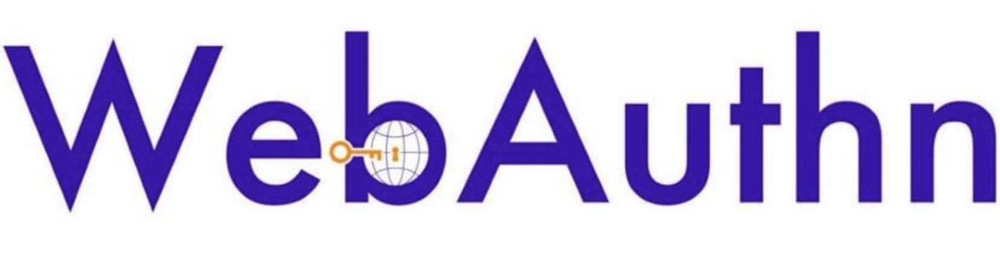

##### Con el paso del tiempo podemos darnos cuenta como el número de servicios que utilizados aumentan, además de las respectivas credenciales que debemos recordar para su acceso. Del mismo modo, al tener éstas una gran importancia, son el principal objetivo en los ataques cibernéticos, poniendo en serio peligro la seguridad (integridad, confidencialidad y disponibilidad) del servicio y de los datos de los usuarios.
##### Así pues, el presente Trabajo Final de Máster tiene como finalidad realizar una introducción sobre el nuevo estándar WebAuthn, un protocolo en los navegadores web que pretende proveer a las aplicaciones web de un sistema de autenticación seguro mediante tokens físicos, donde las contraseñas ya no se tengan que que emplear y donde las tradicionales vulnerabilidades/ataques no tengan cabida.
